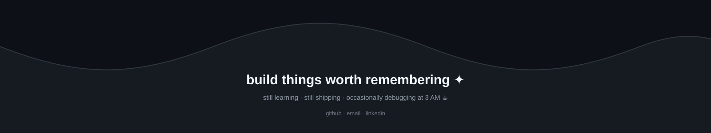

 

INDEPENDENT BUILDER&nbsp; / &nbsp;AI × FULL-STACK&nbsp; / &nbsp;PERPETUAL WORK IN PROGRESS

# turning ambitious ideas into things that actually work.

Usually building something, breaking something, or wondering why it worked five minutes ago.

 

<a href="https://github.com/j25aiml192-hash">GITHUB ↗</a>
&nbsp;&nbsp;·&nbsp;&nbsp;
<a href="mailto:h90519495@gmail.com">EMAIL ↗</a>

 

---

## 01 / neural network

<table border="0" width="100%" cellpadding="0" cellspacing="0">
<tr>
<td width="46%" valign="middle" align="center">

</td>
<td width="54%" valign="middle" align="left">

### hi, I'm Hiten.

An AI/ML-focused engineer and full-stack builder. I like taking ideas that are a little too ambitious, figuring out how the pieces fit together, and shipping something people can actually use.

I work across the stack: **interfaces, APIs, databases, AI workflows, automation, and infrastructure.** I care about the whole product—not just the part that looks good in a screenshot.

 

`CURRENT MODE` &nbsp; **build → break → debug → ship → repeat**

Personal operating principle: less noise, better systems, more things shipped.

</td>
</tr>
</table>

 

---

## 02 / the toolbox

Languages, frameworks, infrastructure, design tools—and a few AI sidekicks.

<table border="1" cellpadding="10" cellspacing="0">
<tr>
<td align="center"> javascript</td>
<td align="center"> typescript</td>
<td align="center"> python</td>
<td align="center"> c++</td>
<td align="center"> c</td>
<td align="center"> html</td>
<td align="center"> css</td>
<td align="center"> sql</td>
<td align="center"> solidity</td>
</tr>
<tr>
<td align="center"> react</td>
<td align="center"> next.js</td>
<td align="center"> vite</td>
<td align="center"> node.js</td>
<td align="center"> express</td>
<td align="center"> tailwind</td>
<td align="center"> mongodb</td>
<td align="center"> supabase</td>
<td align="center"> postgresql</td>
</tr>
<tr>
<td align="center"> firebase</td>
<td align="center"> vercel</td>
<td align="center"> git</td>
<td align="center"> github</td>
<td align="center"> figma</td>
<td align="center"> vscode</td>
<td align="center"> postman</td>
<td align="center"> docker</td>
<td align="center"> linux</td>
</tr>
</table>

 

AI & WORKFLOW SIDEKICKS 
<code>Claude</code> &nbsp;·&nbsp; <code>ChatGPT</code> &nbsp;·&nbsp; <code>Cursor</code> &nbsp;·&nbsp; <code>Railway</code> &nbsp;·&nbsp; <code>Render</code> &nbsp;·&nbsp; <code>Netlify</code> &nbsp;·&nbsp; <code>n8n</code> &nbsp;·&nbsp; <code>Notion</code> &nbsp;·&nbsp; <code>Web3</code>

 

---

## 03 / shipped into the world

Five projects. Different problems. One recurring theme: make the thing work.

<table border="0" width="100%" cellpadding="12" cellspacing="0">
<tr>
<td width="9%" valign="top">01</td>
<td valign="top">

### Spendly

AI-powered SaaS spend intelligence for subscriptions, unused seats, duplicate tools, renewals, invoices, and savings opportunities.

<code>React</code> <code>Express</code> <code>MongoDB</code> <code>Groq</code> 
<a href="https://github.com/j25aiml192-hash/spendly">Explore the repository ↗</a>

</td>
</tr>
<tr><td colspan="2">
</td></tr>
<tr>
<td valign="top">02</td>
<td valign="top">

### VielFi

Wallet-connected lending with borrower/lender flows, loan creation, discovery, dashboards, circles, notifications, and wallet connectivity.

<code>React</code> <code>Vite</code> <code>ethers</code> 
<a href="https://github.com/j25aiml192-hash/vielfi">Explore the repository ↗</a>

</td>
</tr>
<tr><td colspan="2">
</td></tr>
<tr>
<td valign="top">03</td>
<td valign="top">

### NEXUS — SIH

Predictive cybercrime intelligence combining graph analysis, fraud-risk scoring, spatial prediction, H3 mapping, explainability, and operational alerts.

<code>FastAPI</code> <code>React</code> <code>ML</code> <code>Graph Intelligence</code> 
<a href="https://github.com/j25aiml192-hash/nexus-SiH">Explore the repository ↗</a>

</td>
</tr>
<tr><td colspan="2">
</td></tr>
<tr>
<td valign="top">04</td>
<td valign="top">

### NitiSetu

AI-powered governance intelligence for complaint classification, semantic clustering, SLA monitoring, department analytics, geographic monitoring, and decision support.

<code>Next.js</code> <code>FastAPI</code> <code>PostgreSQL</code> <code>Gemini</code> 
<a href="https://github.com/j25aiml192-hash/nitisetu-frontend">Explore the repository ↗</a>

</td>
</tr>
<tr><td colspan="2">
</td></tr>
<tr>
<td valign="top">05</td>
<td valign="top">

### Jorvis

A desktop AI assistant exploring wake-word detection, speech recognition, LLM reasoning, tool execution, text-to-speech, desktop controls, and persistent memory.

<code>Python</code> <code>LLMs</code> <code>Deepgram</code> <code>SQLite</code> 
<a href="https://github.com/j25aiml192-hash/jorvis">Explore the repository ↗</a>

</td>
</tr>
</table>

 

---

## 04 / receipts

<table>
<tr><th align="left">Achievement</th><th align="left">Details</th></tr>
<tr>
<td><strong>1st Position — Hack Energy 2.0 (2026)</strong></td>
<td>Winner at GeeksforGeeks, Noida, Uttar Pradesh. Built the core backend pipeline, ML models, and AI integration for <strong>Spendly</strong>. <a href="https://github.com/j25aiml192-hash/spendly">Spendly on GitHub ↗</a></td>
</tr>
<tr>
<td><strong>1st Runner-Up — SnowFrost Hackathon (2026)</strong></td>
<td>Jamia Hamdard, New Delhi. Worked on UI/UX, dashboard, and forensic analysis for <strong>MatSetu</strong>.</td>
</tr>
<tr>
<td><strong>397th Rank — Prompt Wars</strong></td>
<td>Scored <strong>93.18% accuracy</strong> among <strong>15,000+ students across India</strong>, building <strong>Nittyantra</strong> for Hack2Skill’s Prompt Wars competition.</td>
</tr>
<tr>
<td><strong>5x Hackathon Finalist</strong></td>
<td>Consistently performed at the top across multiple competitions.</td>
</tr>
</table>

 

---

## 05 / signal me

&nbsp;

&nbsp;

 

&nbsp;

&nbsp;

  

<table width="100%" border="0" cellpadding="18" cellspacing="0">
<tr><td align="center" bgcolor="#161B22"><code>"Data tells stories. I build the systems that listen."</code></td></tr>
</table>

 

  

if it can be imagined, it can probably become a very questionable weekend project.

