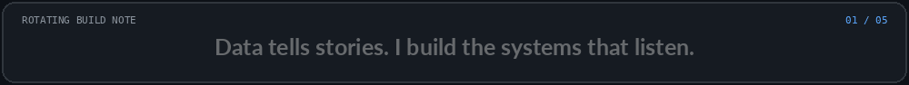

<!--   -->

<!-- Caffineated BUILDER&nbsp; / &nbsp;AI × FULL-STACK&nbsp; / &nbsp;PERPETUAL WORK IN PROGRESS -->

# turning ambitious ideas into things that actually work.

## 01 ME ??

<table border="0" width="100%" cellpadding="0" cellspacing="0" style="width:100%;table-layout:fixed;">
<colgroup><col width="50%"><col width="50%"></colgroup>
<tr>
<td width="50%" valign="middle" align="center">

</td>
<td width="50%" valign="middle" align="left">
<table border="1" width="100%" cellpadding="0" cellspacing="0" bgcolor="#090c10" style="width:100%;table-layout:fixed;border-color:#29323c;">
<tr>
<td bgcolor="#151a20" cellpadding="0" valign="middle">
<table border="0" width="100%" cellpadding="7" cellspacing="0" bgcolor="#151a20">
<!-- <tr>
<td width="24%"><code>● ● ●</code></td>
<td align="center"><code>profile.ts</code></td>
<td width="14%" align="right"><code>TS</code></td>
</tr> -->
</table>
</td>
</tr>
<tr>
<td bgcolor="#090c10" valign="top"><table border="0" width="100%" cellpadding="10" cellspacing="0" bgcolor="#090c10"><tr><td bgcolor="#090c10">
<code style="font-family:Consolas,Monaco,monospace;font-size:12px;line-height:1.2;white-space:normal;overflow-wrap:anywhere;">
01&nbsp;&nbsp;export const&nbsp;Hiten&nbsp;= { 
02&nbsp;&nbsp;&nbsp;&nbsp;name: &quot;Hiten&quot;,&nbsp;// yep, that's me 
03&nbsp;&nbsp;&nbsp;&nbsp;location: &quot;Delhi, India&quot;, 
04&nbsp;&nbsp;&nbsp;&nbsp;education: &quot;B.Tech CSE (AI/ML)&quot;, 
05&nbsp;&nbsp;&nbsp;&nbsp;role: &quot;AI/ML Engineer &amp; Full-Stack Builder&quot;, 
06&nbsp;&nbsp;&nbsp;&nbsp;interests: [&nbsp;// things i enjoy 
07&nbsp;&nbsp;&nbsp;&nbsp;&nbsp;&nbsp;&quot;AI/ML&quot;, &quot;Full-Stack Development&quot;, &quot;Hackathons&quot;, 
08&nbsp;&nbsp;&nbsp;&nbsp;&nbsp;&nbsp;&quot;Automation&quot;, &quot;Product Design&quot;, &quot;Cloud &amp; Infra&quot;, 
09&nbsp;&nbsp;&nbsp;&nbsp;&nbsp;&nbsp;&quot;Side Projects&quot;,&quot;Good Food&quot; 
10&nbsp;&nbsp;&nbsp;&nbsp;], 
11 
12&nbsp;&nbsp;&nbsp;&nbsp;currentFocus: [&nbsp;// currently exploring 
13&nbsp;&nbsp;&nbsp;&nbsp;&nbsp;&nbsp;&quot;DSA&quot;, &quot;AI Agents&quot;, &quot;ML Systems&quot;, 
14&nbsp;&nbsp;&nbsp;&nbsp;&nbsp;&nbsp;&quot;Scalable Backends&quot;, &quot;Interesting Problems&quot; 
15&nbsp;&nbsp;&nbsp;&nbsp;], 
16 
17&nbsp;&nbsp;&nbsp;&nbsp;funFact: &quot;I can code, yap for hours, and still be excited at 2 AM.&quot; 
18&nbsp;&nbsp;};
</code>
</td></tr></table>
</td>
</tr>
<tr>
<!-- <td bgcolor="#151a20">
<table border="0" width="100%" cellpadding="6" cellspacing="0" bgcolor="#151a20">
<tr><td><code>● student → builder → better systems</code></td><td align="right"><code>UTF-8</code></td></tr> -->
</table>
</td>
</tr>
</table>
</td>
</tr>
</table>
 

---

## 02 The Stack

Languages, frameworks, infrastructure, design tools—and a few AI sidekicks.

<table width="100%" style="display:table;width:100%;min-width:100%;table-layout:fixed;" border="1" cellpadding="22" cellspacing="0">
<colgroup><col width="11.111%"><col width="11.111%"><col width="11.111%"><col width="11.111%"><col width="11.111%"><col width="11.111%"><col width="11.111%"><col width="11.111%"><col width="11.111%"></colgroup>
<tr>
<td align="center" valign="middle"> javascript</td>
<td align="center" valign="middle"> typescript</td>
<td align="center" valign="middle"> python</td>
<td align="center" valign="middle"> c++</td>
<td align="center" valign="middle"> c</td>
<td align="center" valign="middle"> html</td>
<td align="center" valign="middle"> css</td>
<td align="center" valign="middle"> sql</td>
<td align="center" valign="middle"> solidity</td>
</tr>
<tr>
<td align="center" valign="middle"> react</td>
<td align="center" valign="middle"> next.js</td>
<td align="center" valign="middle"> vite</td>
<td align="center" valign="middle"> node.js</td>
<td align="center" valign="middle"> express</td>
<td align="center" valign="middle"> tailwind</td>
<td align="center" valign="middle"> mongodb</td>
<td align="center" valign="middle"> supabase</td>
<td align="center" valign="middle"> postgresql</td>
</tr>
<tr>
<td align="center" valign="middle"> firebase</td>
<td align="center" valign="middle"> vercel</td>
<td align="center" valign="middle"> git</td>
<td align="center" valign="middle"> github</td>
<td align="center" valign="middle"> figma</td>
<td align="center" valign="middle"> vscode</td>
<td align="center" valign="middle"> postman</td>
<td align="center" valign="middle"> docker</td>
<td align="center" valign="middle"> linux</td>
</tr>
</table>

 

<table width="100%" style="display:table;width:100%;min-width:100%;table-layout:fixed;" border="0" cellpadding="8" cellspacing="0">
<tr><td align="center">AI & WORKFLOW SIDEKICKS</td></tr>
<tr><td align="center"><code>Claude</code> &nbsp;·&nbsp; <code>ChatGPT</code> &nbsp;·&nbsp; <code>Cursor</code> &nbsp;·&nbsp; <code>Railway</code> &nbsp;·&nbsp; <code>Render</code> &nbsp;·&nbsp; <code>Netlify</code> &nbsp;·&nbsp; <code>n8n</code> &nbsp;·&nbsp; <code>Notion</code> &nbsp;·&nbsp; <code>Web3</code></td></tr>
</table>

 

---

## 03 Shipped Products

Five projects. Different problems. One recurring theme: make the thing work.

 

<table width="100%" border="1" cellpadding="16" cellspacing="8" align="left">
<colgroup><col width="50%"><col width="50%"></colgroup>
<tr>
<td width="50%" valign="top" bgcolor="#111820">
01 / PRODUCT · AI SPEND INTELLIGENCE
<h3>Spendly</h3>

AI-powered SaaS spend intelligence for subscriptions, unused seats, duplicate tools, renewals, invoices, and savings opportunities.

<code>React</code> <code>Express</code> <code>MongoDB</code> <code>Groq</code>

<a href="https://github.com/j25aiml192-hash/spendly">Explore repository ↗</a>
</td>
<td width="50%" valign="top" bgcolor="#111820">
02 / WEB3 · LENDING
<h3>VielFi</h3>

Wallet-connected lending with borrower/lender flows, loan creation, discovery, dashboards, circles, notifications, and wallet connectivity.

<code>React</code> <code>Vite</code> <code>ethers</code>

<a href="https://github.com/j25aiml192-hash/vielfi">Explore repository ↗</a>
</td>
</tr>
<tr>
<td width="50%" valign="top" bgcolor="#111820">
03 / SIH · CYBERCRIME INTELLIGENCE
<h3>NEXUS — SIH</h3>

Predictive cybercrime intelligence combining graph analysis, fraud-risk scoring, spatial prediction, H3 mapping, explainability, and operational alerts.

<code>FastAPI</code> <code>React</code> <code>ML</code> <code>Graph Intelligence</code>

<a href="https://github.com/j25aiml192-hash/nexus-SiH">Explore repository ↗</a>
</td>
<td width="50%" valign="top" bgcolor="#111820">
04 / GOVTECH · AI
<h3>NitiSetu</h3>

AI-powered governance intelligence for complaint classification, semantic clustering, SLA monitoring, department analytics, geographic monitoring, and decision support.

<code>Next.js</code> <code>FastAPI</code> <code>PostgreSQL</code> <code>Gemini</code>

<a href="https://github.com/j25aiml192-hash/nitisetu-frontend">Explore repository ↗</a>
</td>
</tr>
<tr>
<td colspan="2" valign="top" bgcolor="#111820">
05 / DESKTOP AI · PERSONAL ASSISTANT
<h3>Jorvis</h3>

A desktop AI assistant exploring wake-word detection, speech recognition, LLM reasoning, tool execution, text-to-speech, desktop controls, and persistent memory.

<code>Python</code> <code>LLMs</code> <code>Deepgram</code> <code>SQLite</code>

<a href="https://github.com/j25aiml192-hash/jorvis">Explore repository ↗</a>
</td>
</tr>
</table>

 

---

## 04 Achievements

<table width="100%" border="1" cellpadding="10" cellspacing="0" align="left">
<colgroup><col width="32%"><col width="68%"></colgroup>
<tr>
<th width="32%" align="left">Achievement</th>
<th width="68%" align="left">Details</th>
</tr>
<tr>
<td><strong>1st Position — Hack Energy 2.0 (2026)</strong></td>
<td>Winner at GeeksforGeeks, Noida, Uttar Pradesh. Built the core backend pipeline, ML models, and AI integration for <strong>Spendly</strong>. <a href="https://github.com/j25aiml192-hash/spendly">Spendly on GitHub ↗</a></td>
</tr>
<tr>
<td><strong>1st Runner-Up — SnowFrost Hackathon (2026)</strong></td>
<td>Jamia Hamdard, New Delhi. Worked on UI/UX, dashboard, and forensic analysis for <strong>MatSetu</strong>.</td>
</tr>
<tr>
<td><strong>397th Rank — Prompt Wars</strong></td>
<td>Scored <strong>93.18% accuracy</strong> among <strong>15,000+ students across India</strong>, building <strong>Nittyantra</strong> for Hack2Skill’s Prompt Wars competition.</td>
</tr>
<tr>
<td><strong>5x Hackathon Finalist</strong></td>
<td>Consistently performed at the top across multiple competitions.</td>
</tr>
</table>

 

---

## 05 keep in touch

OPEN TO GOOD IDEAS, COLLABORATION, AND PROJECTS THAT GET SLIGHTLY OUT OF HAND.

  

<table width="100%" border="0" cellpadding="4" cellspacing="0" align="center">
<tr>
<td width="16.66%" align="center"></td>
<td width="16.66%" align="center"></td>
<td width="16.66%" align="center"></td>
<td width="16.66%" align="center"></td>
<td width="16.66%" align="center"></td>
<td width="16.66%" align="center"></td>
</tr>
</table>

 

<!--    -->

<!--  -->

<!--    -->

<!-- if it can be imagined, it can probably become a very questionable weekend project. -->

